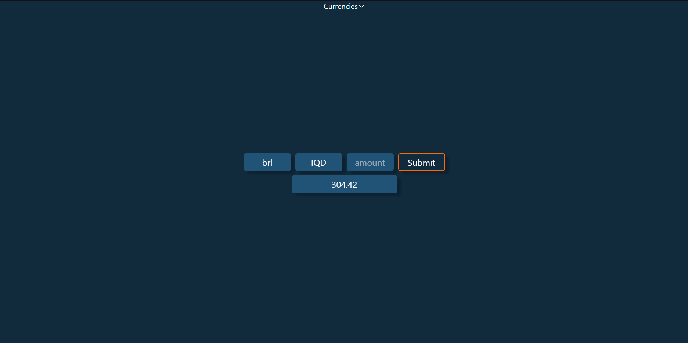

# Currency Web
  
  Currency converter project
  Front-end of the [currency-server](https://github.com/Douglas-Machado/currency-server) api(node)



---

## Technologies

* React
* Typescript
* Axios
* Tailwind
* Phosphor
* Vite

---

## Running the project

Set the `.env.local` VITE_URL, same as the currency-server

Run `npm install` to get the packages
```
  npm install
```

Run `npm run dev` to start the application
```
  npm run dev
```
